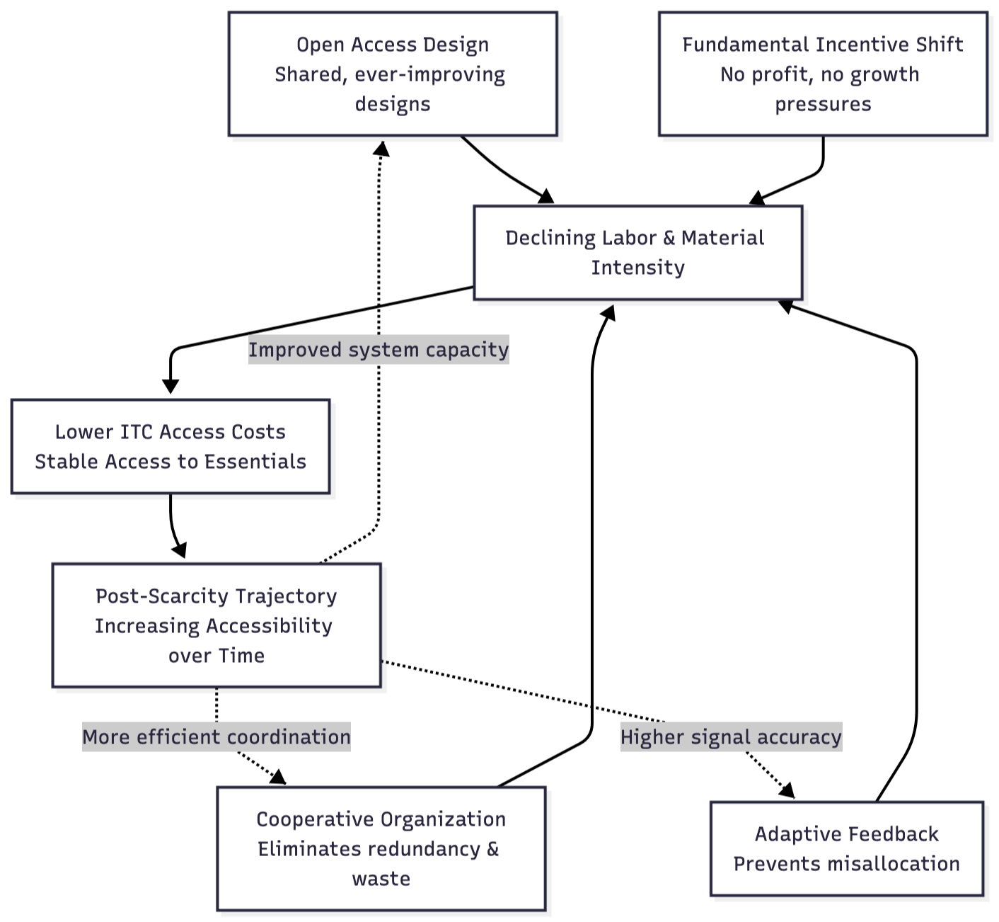
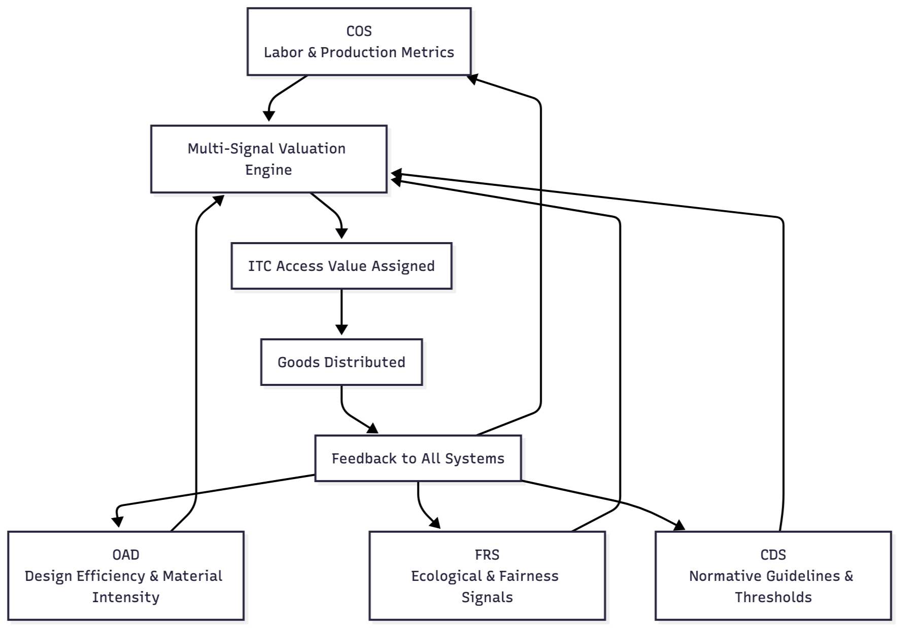

# 4. WHAT INTEGRAL CREATES

If Section 3 outlined the structural problems that market economies cannot overcome, this section describes the core systemic outcomes that Integral enables by design. These outcomes emerge not from ideological intent or policy preferences, but from the functional properties of a cooperative, cybernetically coordinated economic architecture. Each represents a structural advantage of Integral relative to competitive market systems and centralized state planning.

## 4.1 Post-Scarcity Trajectory

Integral does not assume abundance; it creates the conditions under which scarcity diminishes over time. “Post-scarcity” in this context does not mean unlimited resources or frictionless production. It refers to a trajectory in which essential goods and services become increasingly accessible with decreasing labor and ecological cost.

Four mechanisms drive this trajectory:

1. **Open access, open source design** continuously improves tools, appliances, and infrastructure through collective refinement. Because designs are shared rather than proprietary, improvements reduce labor requirements and material intensity across the entire system, lowering future access costs without requiring competitive incentives.
2. **Cooperative organization** eliminates redundant effort. Instead of parallel firms producing similar goods in isolation, Integral coordinates production through shared designs and distributed workflows. This minimizes waste, unnecessary duplication, and the inefficiencies created by competitive market partitioning.
3. **Adaptive feedback** prevents misallocation. Real-time sensing and transparent data ensure that resources, labor, and materials flow where they are actually needed. This avoids the chronic overproduction, shortages, and speculative distortions that arise when systems rely on price signals rather than direct information.
4. **A fundamental incentive shift** distinguishes Integral from market economics. In market systems, firms must generate demand, turnover, and continuous consumption to remain profitable—creating structural incentives for planned obsolescence, resource-intensive marketing, and product redundancy. Integral has no such pressures. Because there is no profit motive, no competitive struggle for market share, and no advantage gained by increased throughput, the system is inherently oriented toward durability, repairability, material conservation, and long-term sufficiency. The absence of growth imperatives removes the economic driver of waste itself.

As these dynamics compound, fewer labor hours are needed to maintain stable access to essentials, and resource intensity declines across the system. This is the structural basis for Integral’s post-scarcity trajectory: **efficiency and sufficiency emerge from cooperation, open design, cybernetic feedback and true economizing—not from growth, competition, or manufactured demand.**

Above Diagram:
This diagram illustrates how Integral generates a post-scarcity trajectory not by assuming abundance but by systematically reducing the labor and material intensity required to meet essential needs. Four reinforcing mechanisms drive this process. Open Access Design (OAD) continuously improves tools, technologies, and methods across all nodes, reducing the difficulty and resource requirements of production. Cooperative Organization (COS) eliminates redundant effort by coordinating shared designs and distributed workflows, preventing the parallel, competitive duplication found in market systems. Adaptive Feedback (FRS) aligns resources with actual conditions, preventing misallocation and ensuring that production follows real patterns of need rather than price fluctuations or speculative demand. Finally, the fundamental incentive shift—arising from the absence of profit pressures, market share competition, and turnover requirements—removes the structural drivers of waste, planned obsolescence, and unnecessary throughput.

As these mechanisms operate together, the labor and material requirements of production decline, lowering ITC access costs and stabilizing access to essential goods and services. This reduction feeds back into each subsystem: improved capacity accelerates design innovation; more efficient coordination reduces logistical overhead; and higher-quality feedback enhances signal accuracy. Over time, these recursive improvements create a trajectory in which scarcity progressively diminishes—not because resources are infinite, but because cooperation, open design, cybernetic feedback, and the removal of growth imperatives collectively expand the system’s ability to meet human needs with less effort and fewer materials. This is the structural meaning of post-scarcity within Integral.

## 4.2 Ecological Balance

Integral embeds ecological constraints directly into the economic process. Unlike markets, which treat environmental impact as an externality, Integral incorporates biophysical information at every stage of production and allocation.

Ecological balance emerges through several mechanisms:

- **Continuous environmental feedback**, where reporting mechanisms track resource cycles, material flows, and ecological thresholds.
- **Design constraints** that prevent high-impact production from scaling unless it meets ecological safety criteria.
- **Lifecycle assessment** integrated into design repositories, ensuring that material use, repairability, recyclability, and end-of-life impacts are known and accounted for.
- **Collective oversight**, where communities can see the ecological implications of their production choices.

Ecology is not an afterthought. It is structurally coupled with economic calculation, ensuring that production stays within planetary boundaries and that ecological degradation is detected and corrected before it becomes systemic.

## 4.3 Trust, Transparency, and Equity

Market systems generate opacity because competitive advantage depends on withholding information. Centralized systems generate opacity because authority is concentrated. Integral eliminates both dynamics by structuring economic coordination around transparency.

Trust emerges not from interpersonal goodwill, but from institutional design:

- **Open records** ensure that contributions, resource use, and access allocation are visible and auditable.
- **Non-transferable time credits** prevent accumulation and eliminate the possibility of converting contribution into long-term power.
- **Shared design repositories** allow anyone to inspect how products are made, what materials they require, and how they affect community resources.
- **Fair-access protocols** ensure that essential goods are available regardless of individual capacity, disability, or temporary hardship. It is built into overall economic calculation.

Equity is not enforced through redistribution; it is maintained organically, structurally by preventing hierarchy and accumulation from emerging in the first place and by ensuring that capacity differences are accounted for in the contribution system. Importantly, the nature of the system also provides no viable incentive for manipulative or dishonest behavior since it is foundationally a collaborative design, not a competitive one. This means violating collaborative integrity ultimately hurts everyone and fosters no long-term advantage for anyone.

## 4.4 A Method of Transition

Integral is designed to grow through voluntary adoption, not by replacing existing systems through force or political capture. Its transition pathway mirrors the cooperative logic of the system itself.

**Early-stage implementation** begins with small mutual-aid groups that operate within the legal and cultural framework of existing societies. These groups create practical value—shared tools, community food infrastructure, open design libraries—without threatening existing institutions.

**Mid-stage growth** occurs as multiple nodes adopt shared standards and begin coordinating labor, design improvements, and resource exchanges. Network effects increase the efficiency and reliability of cooperative production, attracting further participation.

**Late-stage federation** emerges as nodes integrate through open protocols. This produces regional and eventually global coordination without centralization, allowing Integral to coexist with, and gradually displace, market-based production as the more efficient and equitable system.

Throughout this process, participation remains voluntary, local autonomy is preserved, and the system expands only where it demonstrably improves quality of life. Transition is built into the design, not imposed from outside.

## 4.5 True Economic Calculation

Accurate economic coordination requires far more information than market prices can provide. Prices measure willingness and ability to pay—not the physical properties of production, the ecological costs of material extraction, the long-term viability of resource flows, or the real social need for a good or service. As a result, price-driven economies routinely miscalculate: essential goods may be undervalued, destructive activities may appear profitable, and resource-intensive production can expand even when it undermines future capacity. These failures are not anomalies or moral deviations; they stem from the structural limits of a one-dimensional signal that collapses complex realities into a monetary abstraction.

Integral resolves this limitation by replacing price with a **multi-signal form of economic calculation grounded directly in biophysical and social conditions**. Instead of expressing value through markets, Integral derives value **from the production system itself**. COS provides the real production metrics, OAD reduces embodied labor and material intensity through design refinement, FRS monitors ecological strain and fairness distributions, and CDS establishes normative thresholds when systemic decisions are required. Economic calculation is no longer an emergent side effect of exchange but an explicit, transparent, cybernetically guided process.

Three categories of information guide access valuation:

**First**, weighted labor signals capture the actual human effort required for production—including time, skill, difficulty, urgency, and diverse capacities. Labor is not treated as a commodity; it is contextualized according to real conditions and constraints.

**Second**, ecological impact signals account for material composition, embodied energy, regenerative limits, recyclability, repairability, and the broader influence of production on shared ecological systems. These signals ensure that access values reflect not only present conditions but also the long-term stability of the resource base.

**Third**, access and fairness signals track need, availability, usage patterns, essentiality, queuing pressure, and equitable distribution across households and regions. These prevent scarcity from producing exclusion and ensure that goods are allocated according to real social function rather than bargaining power.

These signals converge through a transparent and adaptive valuation process that determines the ITC access value for each good. Because the calculation is anchored in **physical metrics**, **ecological boundaries**, and **social context**, it yields valuations that are more accurate and more sustainable than those produced by markets. Instead of attempting to approximate real conditions through the indirect mechanism of price fluctuations, Integral directly incorporates the relevant variables. And because all signals feed continuously into the valuation process, access values dynamically adjust as production efficiency improves, ecological limits shift, or community needs evolve.

The result is a cybernetically coherent mode of economic coordination—one capable of aligning production and distribution with actual human needs and planetary boundaries. Integral performs the very task that market theorists claim prices achieve but empirically fail to deliver: **true economic calculation grounded in reality rather than exchange.**

Above Diagram:
This diagram illustrates how Integral replaces market price with a multi-signal valuation process rooted directly in biophysical and social conditions. COS supplies embodied labor and production metrics; OAD contributes design efficiencies and material-intensity data; FRS provides ecological impact and fairness signals; and CDS sets normative thresholds and policy boundaries. These inputs converge in a multi-signal valuation engine that determines the ITC access value of each good. Once goods are distributed, usage patterns and resource effects feed back into all four systems, updating the signals that guide future valuations. This adaptive loop ensures that economic calculation remains grounded in real conditions—labor effort, ecological constraints, and community need—rather than speculative demand or purchasing power.
