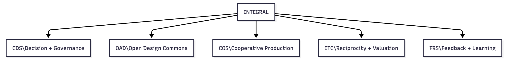
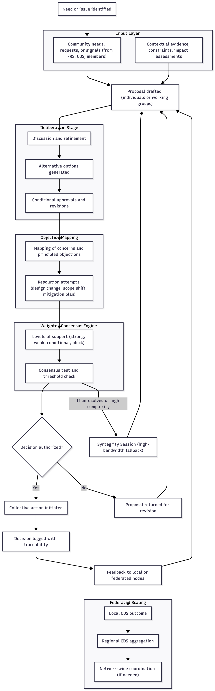
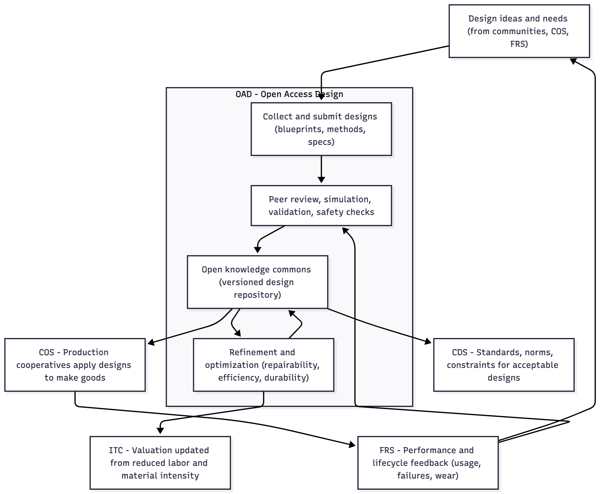
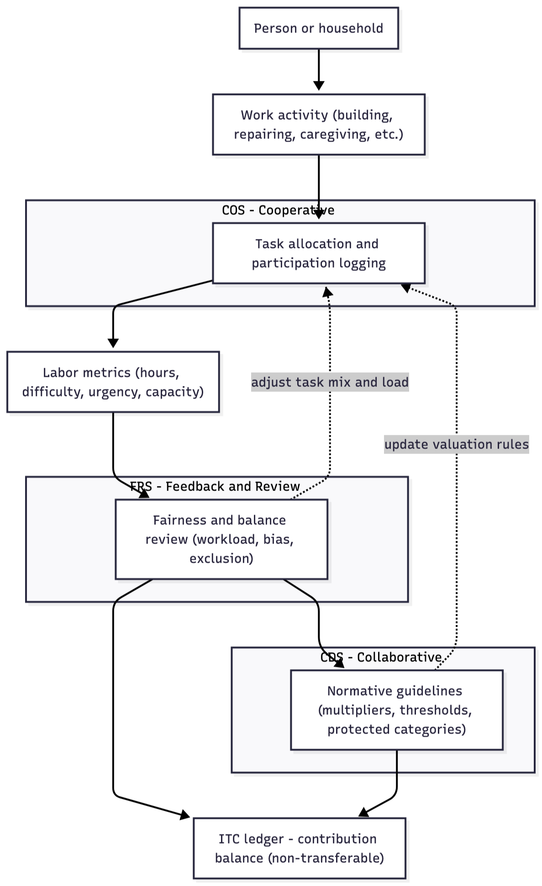
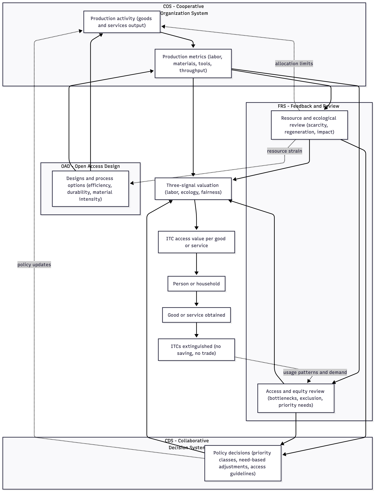
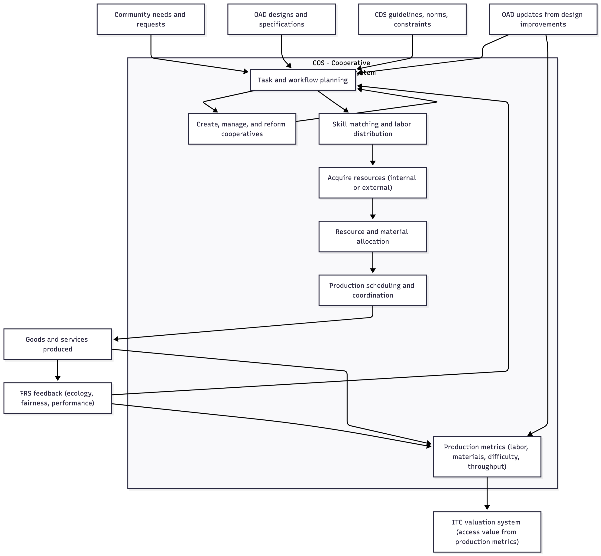
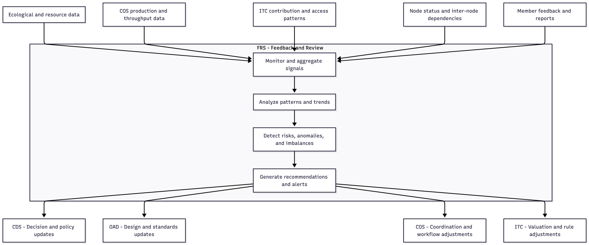

# **5. THE FIVE CORE SUBSYSTEMS (MEZZO LEVEL)**

## 5.1 Overview

*From Village Logic to Scalable Architecture*

The five core systems of Integral translate the cooperative logic of the village example into a structured framework capable of scaling across numerous participants. In the village, coordination occurred through open meetings, shared records, rotating responsibilities, transparent design decisions, and continual feedback. These same functional roles, once formalized and digitized, become Integral’s five subsystems:

- **Collective deliberation → CDS (Collaborative Decision System)**
- **Shared knowledge and design → OAD (Open Access Design)**
- **Fair contribution and access → ITC (Integral Time Credits)**
- **Cooperative production → COS (Cooperative Organization System)**
- **Continuous sensing and correction → FRS (Feedback & Review System)**

This mapping ensures that the reader sees these systems not as abstract technological constructs but as the scaled, formalized versions of patterns that can be understood in less complex, more "organic" arrangements. The mezzo layer is therefore the “translation layer” between human intuitions about cooperation and the cybernetically enhanced architecture that supports large-scale societies. Hence, Integral’s five systems function as interdependent components of a living, self-regulating whole. Each system is semi-autonomous—responsible for a distinct domain—yet tightly coupled through shared information flows. Decisions generate designs; designs structure production; production invokes labor and materials; contribution is recorded and allocated; feedback signals shape future decisions. The result is a continuous, intuitive, adaptive cycle that aligns human well-being, ecological balance, and cooperative productivity.

This section introduces each system at the conceptual level before the next section details their micro-architecture.

## 5.2 CDS — Collaborative Decision System

*Democratic Coordination and Collective Judgment*

In the village, decisions were made in open meetings where everyone understood the context. Proposals were discussed, adjustments were negotiated, and plans were approved only when the group felt conditions were suitable. CDS generalizes this process into a scalable, structured decision pipeline.

CDS provides Integral with a consistent, uniform, transparent method for:

- identifying needs
- generating proposals
- evaluating trade-offs
- resolving objections
- authorizing collective action

CDS ensures that decisions are made *with* the people they affect, not *for* them. Instead of majority rule, CDS employs weighted consensus, objection mapping, contextual evidence review, and transparent traceability. Participants can express not just “yes or no” but degrees of support, conditional approval, or principled objection—mirroring the way villagers collectively gauge readiness, conditions, and consequences before acting. At larger scales, CDS nests local decisions into federated ones, allowing autonomy at small scales and coherence at broader scales. It functions as the cognitive layer of the economic organism.

As an aside, while Integral is conceived first and foremost as a democratic economic system, its overlap with broader democratic processes is entirely fluid. The same tools that enable cooperative economic coordination—direct participation, transparent deliberation, and algorithmic assistance—naturally extend to community decision-making at every level. In principle, this framework could replace the entire architecture of representative democracy itself. That said, this is not the immediate focus. Given the transitional realities faced, the priority is to establish economic intelligence and coordination first; political transformation emerges downstream from that foundation.

Above Diagram: 
This chart illustrates the structured decision-making cycle of the Collaborative Decision System. A need or issue is first identified through member input, contextual evidence, or signals arising from other systems such as FRS or COS. Individuals or working groups draft proposals, which move into a deliberation stage where participants refine ideas, generate alternatives, and articulate conditions for approval. Objection mapping captures principled concerns and enables modification of the proposal through design changes, scope adjustments, or mitigation plans. Once refined, the proposal enters a weighted consensus process in which participants register degrees of support rather than binary votes.

If the consensus threshold is met, the decision is authorized, logged with full traceability, and executed. If not, the proposal returns for revision. When disagreements remain unresolved after reasonable refinement—or when the issue is complex enough to exceed the bandwidth of standard deliberation—the system escalates to a Syntegrity Session. Syntegrity provides a high-structure, high-bandwidth dialogue process that surfaces distributed knowledge and integrates multiple perspectives. The output is a clarified, often more robust proposal that reenters the CDS pipeline for consensus testing. Results feed into local and federated nodes, supporting coherence across scales. In this way, CDS ensures that decisions are transparent, adaptive, democratic, and collectively owned, while Syntegrity acts as a specialized mechanism for resolving complexity when conventional deliberation is insufficient.

## 5.3 OAD — Open Access Design

*The Shared Knowledge and Innovation Commons*

The village kept a notebook where tools, well designs, irrigation plans, and repair methods were recorded and improved, democratically, over time. OAD transforms this into a continuously updated, globally accessible analytical efficacy system and repository and of all designs, processes, and technical knowledge used across Integral nodes. This collaborative, creative process replaces the development stage of private enterprise within the competitive market economy.

OAD is the epistemic backbone of the system. It includes, in part:

- product blueprints
- agricultural and manufacturing methods
- material specifications
- safety and lifecycle analyses
- repair and disassembly guides
- simulation and testing data

There is no intellectual property. Knowledge is treated as a commons: transparent, shareable, and continuously improved. When a design is optimized—made easier to build, more repairable, or more resource-efficient—every node benefits immediately. This global learning effect is one of the primary engines of Integral’s post-scarcity trajectory. OAD supplies the structured knowledge that production cooperatives turn into real goods and infrastructure.

Above Diagram:
This diagram illustrates how the Open Access Design system functions as the knowledge infrastructure of Integral. Design ideas and technical needs enter OAD from communities, production cooperatives, and feedback signals gathered through FRS. These proposals are collected and formalized into blueprints, specifications, methods, and process descriptions. They then undergo peer review, simulation, validation, and safety analysis to ensure feasibility and reliability. The resulting approved designs enter the shared, version-controlled knowledge commons, where they remain transparent, accessible, and universally available across all nodes.

Designs are continually refined and optimized—made easier to build, more repairable, more durable, or less resource-intensive—and these improvements propagate instantly to every cooperative that uses them. Production cooperatives (COS) draw directly from the OAD repository to create real goods and infrastructure, while CDS may define standards or constraints that guide design acceptability. Performance data, failures, wear patterns, and lifecycle information flow back into OAD through FRS, informing further refinement. When improvements reduce labor or material intensity, ITC valuations adjust accordingly. In this way, OAD acts as the epistemic backbone of Integral, enabling global learning, accelerating innovation, and driving the system’s long-term post-scarcity trajectory.

## 5.4 ITC — Integral Time Credits

*Fair Reciprocity and Cybernetic Access Valuation*

In the village, effort was recorded in a shared ledger that accounted for skill, timing, seasonal demands, and differences in capacity. When households received goods, the corresponding credits were removed. Access reflected the quantified work and materials involved rather than negotiation, bargaining power, or artificial scarcity. ITC formalizes this logic into a scalable system that regulates both contribution and access without functioning as money.

Where the village relied on simple estimations of effort, Integral extends the method: **ITC values emerge directly from COS production metrics**—the labor embodied in a good, the materials and tools required, and the ecological impact of producing it—combined with fairness and accessibility signals from FRS. This ensures that access values reflect real system conditions rather than market dynamics.

- **ITC records and regulates:**
  - **Verified labor contributions**, contextualized by skill, difficulty, urgency, and individual capacity differences (health, disability, age).
  - **Access to goods and services**, determined by a cybernetic valuation process grounded in COS production data rather than demand or exchange.
  - **Labor-weighted effort**, ecological impact, materials usage, and fairness/need signals, which together generate *ITC access values* for all produced goods.
  - **Extinguishing of credits upon use**, preventing accumulation, trade, speculation, or conversion into power.
  - **Cross-node participation**, allowing labor and access to remain coherent across a federated network.

**ITC is not a currency.** It cannot be transferred, saved, or used as leverage. Instead, it functions simultaneously as:

1. **A reciprocity ledger** — recognizing and contextualizing contribution.
2. **An economic-calculation engine** — determining the access value of goods based on embodied labor, material cost, ecological impact, scarcity conditions, and fairness adjustments.

The three-signal valuation method—**labor, ecology, and fairness**—ensures that allocation reflects *real conditions* rather than price or demand. When a person accesses a good, the required ITCs are extinguished. The Feedback & Review System (FRS) continuously monitors ITC flows and production patterns to preserve systemic balance without requiring monetary-style equilibrium between total credits and total goods.

This dual function—contribution recognition and adaptive access valuation—makes ITC the metabolic regulator of Integral. As OAD improves designs and COS increases production efficiency, the ITC access cost of goods naturally declines. This decline is not a subsidy but a structural outcome of cooperation, refined design, reduced material intensity, and continuous optimization. Over time, ITC guides the system toward lower labor burdens, greater sufficiency, and reliable access without relying on money, growth imperatives, or competitive incentives.

Above Diagram: *Labor → ITC (Contribution Recognition Loop)*

This chart illustrates how Integral recognizes and contextualizes human contribution without treating labor as a commodity. Work activity flows into COS, where tasks are logged and characterized according to difficulty, urgency, and individual capacity. These labor metrics are then evaluated by FRS, which ensures workloads remain balanced and that no person or demographic group is structurally disadvantaged. CDS provides the normative rules—multipliers, protected-category adjustments, and thresholds—that guide how contributions are valued. Together, these systems determine how many ITCs are recorded in a person’s ledger. The process is non-monetary, non-transferable, and free of accumulation dynamics. Feedback loops from FRS and CDS adjust future task allocation and valuation rules, ensuring labor recognition remains fair, adaptive, and locally responsive. This loop defines how ITCs come into existence as a record of meaningful participation.

Above Diagram: *Production → ITC Access Value (Economic Calculation Loop)*

This chart shows how access values for goods and services are generated through cybernetic economic calculation rather than markets or price signals. COS captures detailed production metrics—embodied labor, material usage, tool wear, and throughput constraints—while OAD shapes the available designs, influencing efficiency and resource requirements. FRS evaluates these metrics from two angles: ecological viability and resource strain, and equity in access and distribution. CDS supplies policy-level guidance when systemic adjustments are needed, such as priority classes or need-based access modifiers. These inputs converge in a three-signal valuation node—labor, ecology, fairness—which determines the ITC access value of each good or service. When a person obtains the good, the corresponding ITCs are extinguished, preventing accumulation or leverage. Usage patterns, strain, and distributional outcomes flow back through FRS to COS, OAD, and CDS, forming a continuous adaptation cycle. This loop replaces market pricing entirely, grounding valuation in measurable production realities and community-defined fairness.

**Walkthrough:**

1. **People contribute labor.**
   This may involve building, repairing, caregiving, growing food, or any other recognized work.
2. **That contribution is recorded in the ITC ledger.**
   Nothing is traded or bought—participation is simply logged fairly.
3. **From production data, the system generates access values for goods or services.**
   Using COS metrics (labor embodied, materials used, tooling wear, ecological cost) and FRS fairness signals, the system determines the ITC value of each good.
   *Your contribution determines access—not money, demand, or negotiation.*
4. **People obtain goods.**
   Whether it is food, a repaired item, or a bicycle, access is based on the real effort that produced it.
5. **When goods are received, the ITCs used to access them disappear.**
   They cannot be saved or exchanged. They *burn off* like calories after energy is spent.

**Where improvement happens — the adaptive loop:**

1. **The ledger and usage patterns are monitored by FRS (Feedback & Review System).**
   This allows the system to evaluate:
   - Is access fair?
   - Is labor balanced?
   - Is there scarcity or surplus?
   - Are ecological limits respected?
2. **If something is inefficient, FRS sends update signals outward** — not just back to ITC.
   It identifies where improvement should occur:
   - **OAD**, if the *design* needs refinement
     (easier to build, repair, sustain, or less material-intensive)
   - **COS**, if *workflow or labor organization* requires adjustment
     (better scheduling, smoother throughput, reduced bottlenecks)
3. **Updates from OAD and COS feed back into production.**
   - Better designs → less labor → *lower access values*
   - Better coordination → greater throughput → *more availability*
   - Better material practices → reduced ecological cost → *improved sustainability*
4. **This is how post-scarcity emerges naturally.**
   Not from abundance or ideology, but from continuous cooperative refinement.

**Dynamic Valuation and Continuous Adjustment**:

Both labor valuation and access valuation within ITC remain dynamically adjustable. ITC values shift in response to changes in production efficiency, ecological conditions, community needs, and fairness requirements. COS provides real production metrics; FRS identifies imbalances or emerging constraints; OAD reduces embodied labor and material intensity through design refinement; and CDS establishes normative guidelines when systemic decisions are required. Together, these mechanisms ensure that ITC values are never rigid or arbitrary, but evolve continuously to reflect real conditions and collective priorities. This dynamic recalibration is what allows Integral to achieve accurate economic calculation without markets, prices, or monetary incentives

## 5.5 COS — Cooperative Organization System

*Distributed Production, Coordination, and Flow Management*

In the village, small rotating groups ensured tasks were done, tools maintained, crops harvested, and resources distributed. They did not command; they coordinated. COS formalizes this function into a distributed production and resource system that organizes real-world activities across a node.

**COS handles:**

- creation, management, and continual re-formation of cooperatives
- task and workflow planning
- skill-matching and labor distribution
- resource and material allocation
- acquisition of required resources, whether already available within the node or obtained externally
- production schedules and throughput
- internodal resource sharing
- generation of production metrics used for ITC valuation

COS replaces corporate hierarchy and market competition with transparent, needs-driven cooperation. Its role is not managerial authority but cybernetic coordination: ensuring that labor, materials, and tools flow where they are actually needed, without bottlenecks or duplication. When production requires materials or components not currently present in the node, COS is also responsible for sourcing them—first through internal inventories or nearby nodes, and only then through external procurement channels.

A critical function of COS is producing the quantitative data used by the ITC valuation system. For every good or service, COS records:

- embodied labor hours
- skill-weight and task difficulty
- urgency and seasonal timing
- material usage and tooling wear
- production throughput and constraints

This information feeds directly into the multi-signal valuation process that determines ITC access values. As production methods improve (via OAD updates) or as feedback identifies inefficiencies (via FRS), COS updates workflows accordingly. When improvements reduce labor or material intensity, the ITC access cost for goods naturally declines.

COS is the operational engine that turns OAD designs into real goods, generates the metrics required for accurate economic calculation, and enables the adaptive coordination on which the entire system depends.

Above Diagram:
This flow diagram shows how COS converts community needs, design specifications, and policy boundaries into coordinated production. Cooperative formation and planning occur continuously, allowing COS to create or reorganize production groups as conditions change. Once a production task is defined, COS matches skills, acquires required resources—drawing first from internal inventories, then from nearby nodes, and finally from external sources if necessary—and allocates materials accordingly. Scheduling organizes the workflow that leads to actual production.

As goods are produced, COS generates detailed production metrics, including labor hours, difficulty weighting, material use, and throughput constraints. These metrics feed directly into the ITC valuation system, enabling accurate, multi-signal economic calculation. Feedback from FRS and design improvements from OAD continuously update planning and metrics, ensuring that COS remains adaptive, efficient, and aligned with ecological and social needs.

## 5.6 FRS — Feedback & Review System

*Adaptive Monitoring, Diagnostics, and Systemic Learning*

In the village, a rotating team gathered observations from households and brought them to community meetings. This ensured that unexpected conditions—workload imbalance, resource shortages, timing issues—were identified before they became disruptive. FRS scales this essential function into a continuous sensing and diagnostic framework.

**FRS monitors:**

- ecological conditions and resource limits
- material and energy throughput
- production efficiency and workflow bottlenecks
- fairness in contribution, access, and labor distribution
- ITC dynamics: contribution patterns, access patterns, valuation effects, and systemic balance
- node autonomy, inter-node/resource dependencies, and resilience
- system performance, risk conditions, and anomaly detection

FRS then feeds this information back to CDS, OAD, COS, and ITC, triggering adjustments across all systems. It validates the integrity of incoming data, detects misalignment between valuations and real conditions, and highlights where design, coordination, or policy changes are needed.

FRS is the adaptive nervous system of Integral: continuously observing, analyzing, diagnosing, and guiding improvements. Without FRS, the system would drift; with FRS, it becomes self-correcting, continuously aligning production, access, and ecological conditions across the entire network.

Above Diagram: This diagram shows how FRS functions as Integral’s diagnostic and regulatory nervous system. Multiple categories of information—ecological data, production metrics, ITC contribution and access patterns, node-level conditions, and direct member feedback—flow into FRS, where they are continuously monitored and aggregated. FRS analyzes these signals to identify trends, inefficiencies, risks, or emerging imbalances, and then performs diagnostic checks to detect anomalies or misalignments between actual conditions and system operation.

Based on this analysis, FRS generates targeted recommendations that update the other four systems: CDS receives policy-level guidance, OAD receives design or standards refinements, COS receives coordination and workflow adjustments, and ITC receives valuation or rule modifications. Through this ongoing loop, FRS ensures that Integral remains adaptive, fair, efficient, and ecologically aligned, allowing the system to correct itself before small issues become structural problems.
