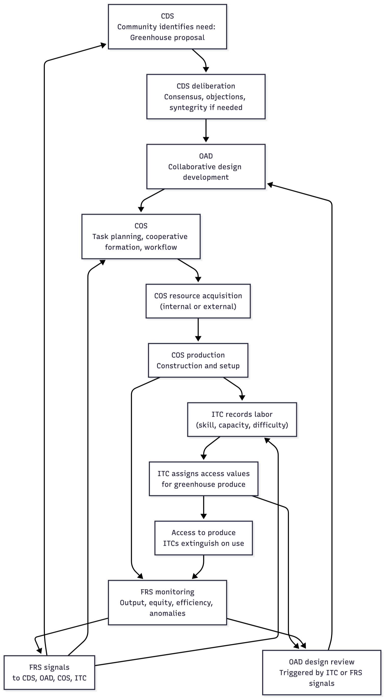

# 6. HOW THE FIVE SYSTEMS WORK AS ONE

The five systems of Integral—CDS, OAD, ITC, COS, and FRS—are not independent components. They form an integrated, continuously cycling architecture in which each subsystem feeds, constrains, and corrects the others. This coupling transforms Integral from a set of tools into a coherent economic organism. Through their interaction, the system identifies needs, designs solutions, coordinates production, regulates contribution and access, and improves itself through continuous feedback.

## 6.1 High-Level Interaction Flow

At the mezzo level, an Integral node operates through a **continuous cybernetic cycle**. In simplified form:

**1. CDS → Identifies Needs and Authorizes Action**
The Collaborative Decision System captures proposals, evaluates alternatives, maps objections, and authorizes projects. CDS defines what the community intends to do and the normative or ecological boundaries within which it should occur.

**2. OAD → Translates Needs into Validated Designs**
Approved projects enter Open Access Design, where they become transparent, version-controlled technical specifications. OAD ensures each design is feasible, efficient, safe, and ecologically aligned before COS initiates production. When ITC or FRS data indicate that a design is too labor- or material-intensive, OAD triggers a review that prompts the responsible design teams to explore revisions that improve efficiency, reduce resource use, or simplify production. In this way, OAD serves as the system’s technical refinement layer—continuously guiding designs toward lower labor burden, longer lifecycle performance, and stronger ecological alignment.

**3. COS → Coordinates Production and Resource Flow**
The Cooperative Organization System operationalizes OAD designs: forming or reforming cooperatives, scheduling tasks, allocating materials, matching skills, and acquiring resources internally or externally. COS ensures production aligns with real labor capacity, resource availability, and ecological constraints while generating the production metrics needed for accurate ITC valuation.

**4. ITC → Regulates Contribution and Access**
Integral Time Credits record verified labor contributions (adjusted for skill, difficulty, urgency, and capacity) and determine the access value of all produced goods. ITC provides:

- a fair reciprocity mechanism
- a non-monetary method of economic calculation
- an allocation system grounded in labor, ecology, and need

Credits extinguish upon use, preventing accumulation, speculation, or influence. ITC signals also inform COS and OAD when certain goods require redesign, increased capacity, or workflow improvements.

**5. FRS → Evaluates Outcomes and Signals Corrections**
The Feedback & Review System monitors ecological impacts, resource throughput, production efficiency, ITC contribution and access patterns, fairness, and node interdependencies. FRS identifies imbalances or risks and issues structured feedback:

- to CDS for policy or boundary adjustments
- to OAD for design refinement
- to COS for workflow and coordination changes
- to ITC for recalibration of access values or weighting

FRS ensures that Integral does not drift; it continually realigns the system with real conditions.

**6. The Loop Repeats**
Each cycle becomes the input of the next: needs → design → production → contribution/access → feedback → new needs. This recursive, self-correcting metabolism replaces the price mechanism, corporate hierarchy, and state command with a continuous, adaptive flow of information and cooperation. It is the structural core that enables Integral to function as a viable, post-monetary economic system.

## 6.2 Example: Greenhouse

Consider a community that wants to improve year-round food stability. Several residents propose building a greenhouse, and the idea enters the Collaborative Decision System.

**1. Democratic Need Identification (CDS)**

The CDS brings people together—in person or through its digital platform—to discuss why a greenhouse is needed, who benefits, and what concerns exist. Different locations are debated, maintenance implications are raised, and participants build a shared understanding of the project.

CDS tools such as objection mapping, argument clustering, evidence tagging, and scenario comparison help clarify where agreement exists and where uncertainty remains. A consensus-gradient display shows whether the group is converging or requires further deliberation. If dialogue stalls, the system can invoke Beer’s *Syntegrity* process to surface constraints and resolve bottlenecks.

Through this process, the community reaches a democratic consensus that the greenhouse should be built and outlines its purpose, scale, and operational boundaries.

**2. Collective Design Development (OAD)**

The approved project moves into the Open Access Design environment. Anyone may contribute—those with engineering or horticultural experience often take the lead, but expertise is not a requirement. Most participation is voluntary unless the community formally designates the project as urgent, in which case certain OAD tasks may earn ITC.

Participants explore existing open-source greenhouse designs or assemble a new one collaboratively within the OAD workspace. They refine questions such as:

- size and structural form
- local material suitability
- insulation and energy efficiency
- water cycling and soil systems
- ecological footprint and lifecycle considerations

All design iterations are stored transparently, allowing community review and incremental improvement. OAD also acts as a global repository: every node benefits from the accumulated knowledge and refinements of others.

As the design progresses, subjective disagreements naturally diminish. The functional and ecological requirements of a greenhouse constrain options, reducing arbitrary preference-divergence. Creative differences may remain, but these can be resolved through CDS if necessary.

If ITC or FRS later reveal that the greenhouse design results in high labor or material burden, OAD triggers a design-review process, prompting the responsible team to improve efficiency or reduce resource use.

**3. Cooperative Production (COS)**

Once the design is finalized, the project enters the Cooperative Organization System. COS is not a managerial authority but a coordination framework used by community members who volunteer to organize the work.

COS decomposes the design into clear tasks, schedules workflows, matches skills, and ensures material readiness. Participants sign up for tasks they are capable of performing and earn ITC for their contribution.

COS also manages **resource acquisition**.

- If materials exist within the node, COS reserves them through existing cooperatives (such as tool libraries or fabrication groups).
- If materials must be sourced externally, COS forms a temporary *acquisition cooperative* to purchase, trade for, or negotiate inter-node transfers of the required items.

To carry out the work, COS forms the necessary cooperatives—carpentry, glazing, irrigation, soil preparation, and ongoing maintenance. Some become permanent; others dissolve after the project. COS keeps everything visible and organized so that work flows smoothly, no one is overburdened, and no hierarchy is required.

As production proceeds, COS generates the quantitative data—labor hours, skill-weighting, material use, and throughput—used later by ITC to determine access values.

**4. Fair Contribution and Access (ITC)**

All verified contributions to the greenhouse earn ITCs. The system accounts for differences in skill, difficulty, urgency, and personal capacity, ensuring fairness and preventing hidden labor inequalities.

Once operational, the greenhouse becomes part of the community’s food infrastructure. ITC determines access values for produce based on three integrated signals:

1. real labor embedded in production and maintenance
2. material and ecological costs
3. fairness and community need, ensuring that essentials remain accessible regardless of age or ability

When someone collects produce, the required ITCs are simply extinguished. They are not saved, traded, or converted into influence. Over time, if OAD and COS improve production efficiency, the ITC access value of produce naturally declines, moving toward "zero marginal cost."

**5. Continuous Review and Improvement (FRS)**

Once the greenhouse is active, the Feedback & Review System monitors how it performs. Members see simple, intuitive indicators:

- harvest output trends
- water and energy use
- maintenance cycles
- access patterns and equity
- emerging bottlenecks

People can submit quick notes—“north row drying out,” “vent sticking,” “overflow of herbs”—and FRS aggregates these signals to detect patterns.

FRS modules highlight issues:

- **design performance** → signals OAD
- **effort imbalance** → signals ITC
- **coordination friction** → signals COS
- **policy questions** → signals CDS

The greenhouse becomes more efficient each season because feedback is easy to contribute, easy to view, and easy to act on.

**Result**
The greenhouse becomes a living part of the community’s infrastructure—democratically initiated, collaboratively designed, cooperatively built, fairly accessed, and continuously improved. No competition, prices, or bargaining are needed. The system works because each subsystem reinforces the others, creating a self-correcting economic metabolism.

Above Diagram: 
This diagram shows how the greenhouse project moves through all five Integral systems in a continuous adaptive loop. The process begins in CDS, where the community deliberates and authorizes the project. OAD then develops the collaborative design, drawing on shared knowledge and open iterations. COS coordinates production by forming cooperatives, scheduling tasks, acquiring resources, and carrying out construction. As work proceeds, COS generates the labor and material data used by ITC to record contributions and assign access values for the produce that the greenhouse will generate.

Once the greenhouse is operational, FRS monitors its performance—tracking harvest output, ecological conditions, labor rotation, maintenance needs, and access patterns. If FRS or ITC data reveal inefficiencies, such as excessive labor burden or material use, these signals trigger an OAD design review. The responsible design teams then revise the greenhouse design to improve efficiency or sustainability. Updated designs flow back into COS for implementation, and the cycle begins again.
