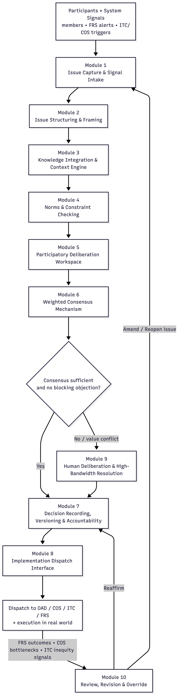

# **7. ARCHITECTURE: MODULES OF EACH SYSTEM (MICRO LEVEL)**

These modules are the functional “cells” of the Integral organism—micro-level units that break down each subsystem into executable logic. Each module performs a discrete, formally definable operation: capturing input, organizing knowledge, validating feasibility, allocating labor, updating credits, monitoring ecological constraints, or analyzing system behavior. These are not only conceptual abstractions; they are the objects and functions that will become code. In implementation, the modules form the class structures, APIs, state machines, and data flows that animate the software itself.

When interconnected, these micro-modules scale into workflows that govern cooperatives, nodes, and ultimately the global federation. Higher layers of Integral do not introduce new logic—they simply federate, synchronize, and recurse these same micro-operations. The mezzo and macro layers are therefore scaled reflections of what is defined here: repeating patterns of coordination, decision, verification, allocation, and feedback.

We begin with the Collaborative Decision System (CDS)—the subsystem that encodes participatory governance for all of Integral. Every normative choice—design approvals, project initiation, labor weighting rules, ecological thresholds, access constraints, and the evaluation of feedback signals—ultimately passes through CDS. Its micro-architecture is the foundation for the other four systems, providing the decision logic that contextualizes OAD, COS, ITC, and FRS.

## 7.1 CDS Modules

The **Collaborative Decision System (CDS)** is Integral’s participatory governance engine—a recursive, multi-stage deliberation pipeline that transforms raw human input into coherent, transparent, collectively rational decisions. CDS replaces voting, market negotiation, managerial decree, and bureaucratic hierarchy with a **structured cybernetic process** that integrates human judgment, ecological constraint, and system feedback.

CDS operates as a **decision metabolism**, not a parliament. It does not aggregate preferences through majority rule or price signals, but instead coordinates distributed intelligence through sequential cognitive functions that mirror how adaptive organisms make viable choices under constraint.

Specifically, CDS:

- gathers and authenticates proposals, objections, and system signals
- organizes issues into coherent frames, scopes, and decision spaces
- integrates relevant evidence, historical precedent, and ecological limits
- evaluates scenarios against fairness, safety, and constitutional boundaries
- supports transparent, structured human deliberation
- synthesizes weighted consensus and objection-mapped acceptability ranges
- escalates irreducible value conflicts into high-bandwidth human processes
- records every step for auditability and democratic memory
- dispatches approved decisions into coordinated system action
- **periodically revisits past decisions in light of real-world outcomes and FRS feedback**

CDS is not a digital legislature. It is a **cybernetic governance system** modeled on how adaptive systems coordinate perception, reasoning, constraint enforcement, learning, and correction over time. Each module performs a necessary cognitive function—perception, structuring, contextualization, boundary checking, deliberation, synthesis, coordination, memory, escalation, and revision.

***

**CDS MODULE OVERVIEW TABLE:**

| CDS Module                                             | Primary Function                                             | Real-World Analogs / Technical Basis                         |
| ------------------------------------------------------ | ------------------------------------------------------------ | ------------------------------------------------------------ |
| **1. Issue Capture & Signal Intake**                   | Collect proposals, objections, and triggers from participants, FRS alerts, and ITC weighting signals | Decidim intake portals, civic petition systems, authenticated identity gateways |
| **2. Issue Structuring & Framing Module**              | Organize issues into coherent problem frames, scopes, dependencies, and decision parameters | Argument mapping tools, policy templates, ontology-based structuring |
| **3. Knowledge Integration & Context Engine**          | Aggregate evidence, models, ecological thresholds, historical records, and node-specific constraints | Research aggregators, GIS dashboards, evidence commons       |
| **4. Norms & Constraint Checking Module**              | Test scenarios against ecological limits, fairness rules, ITC access policies, safety and harm boundaries | Policy engines, OPA/Rego-style rule systems                  |
| **5. Participatory Deliberation Workspace**            | Enable transparent, multi-user discussion, objection mapping, and proposal refinement | Polis, Kialo, Loomio, semantic deliberation systems          |
| **6. Weighted Consensus Mechanism**                    | Synthesize preference gradients, identify acceptability ranges, detect blocking objections, and quantify consensus | Condorcet logic, quadratic-style weighting, consensus analytics |
| **7. Decision Recording, Versioning & Accountability** | Archive decisions, rationale, evidence links, version history, and full process trace | Git-style versioning, append-only ledgers, cryptographic attestations |
| **8. Implementation Dispatch Interface**               | Translate approved decisions into actionable instructions for OAD, COS, ITC, and FRS | Workflow engines, orchestration APIs, event dispatch systems |
| **9. Human Deliberation & High-Bandwidth Resolution**  | Resolve irreducible value conflicts, cultural meaning disputes, and ethical tensions beyond computational inference | Facilitated deliberation, Syntegrity, ethical review panels  |
| **10. Review, Revision & Override Module**             | Reevaluate, amend, or reopen past decisions based on FRS feedback, implementation outcomes, or changed conditions | Constitutional review processes, adaptive governance loops   |

### Module 1: Issue Capture & Signal Intake

**Purpose**
Serve as the authenticated perceptual gateway through which all governance-relevant input enters the Collaborative Decision System.

**Description**
Module 1 collects, validates, and timestamps all incoming governance signals, ensuring that CDS operates on **real, attributable, non-duplicated input** rather than noise or manipulation.

Inputs include:

- human-generated proposals, concerns, objections, and supporting evidence
- preference gradients and conditional approvals
- micro-surveys for rapid situational sensing
- alerts and signals from **FRS** (ecological risk, system stress)
- adjustment requests from **ITC** (weighting, fairness, access strain)
- operational triggers from **COS** (capacity constraints, workflow failures)

Every submission is identity-verified (human or system), deduplicated, and normalized into a clean issue bundle. Module 1 performs **no evaluation or prioritization** — it exists solely to ensure that *nothing relevant is lost and nothing illegitimate enters the system*.

**Example**
Residents submit proposals to renovate a shared tool library. Others submit concerns about accessibility and noise. COS flags repeated tool damage. FRS adds a signal about airflow-related corrosion. Module 1 authenticates and bundles all inputs into a single issue object for structuring.

***

### Module 2: Issue Structuring & Framing Module

**Purpose**
Transform raw, unstructured input into coherent problem frames that can be collectively reasoned about.

**Description**
Module 2 converts a flat list of submissions into a **cognitive map of the issue space**. Using semantic clustering, argument mapping, and scope analysis, it:

- groups related proposals and objections
- reveals shared assumptions and hidden conflicts
- identifies sub-issues and dependencies
- extracts implicit values and priorities
- defines what *is* and *is not* within scope

This module does not judge proposals. It clarifies *what the actual decision is* so participants are not talking past one another or arguing at incompatible levels of abstraction.

**Example**
Tool-library submissions cluster into themes: ventilation, accessibility, storage layout, noise, and material constraints. The module reveals that most concerns stem from airflow, not misuse — reframing the problem from “behavior” to “design.”

***

### Module 3: Knowledge Integration & Context Engine

**Purpose**
Provide a shared, evidence-rich decision context grounded in physical, ecological, historical, and operational reality.

**Description**
 Module 3 aggregates all **relevant knowledge** needed to responsibly evaluate proposals, including:

- ecological thresholds and environmental indicators (from FRS)
- material availability, tool capacity, and labor windows (from COS)
- fairness and access constraints (from ITC)
- historical precedents and past decision outcomes
- safety standards, architectural constraints, and design references (from OAD)

The result is a unified **context model** that replaces opinion-based debate with *situational awareness*. Module 3 does not advocate outcomes; it ensures that all participants deliberate within the same factual landscape.

**Example**
The system compiles airflow data, corrosion logs, accessibility standards, past renovations, and existing OAD design templates. It reveals that overcrowding and humidity — not overuse — explain most tool damage.

***

### Module 4: Norms & Constraint Checking Module

**Purpose**
Ensure that all proposed scenarios remain within ecological, social, technical, and constitutional boundaries.

**Description**
Module 4 acts as CDS’s **viability filter**. It tests candidate scenarios against:

- ecological ceilings and regeneration limits
- material and energy availability
- labor capacity and skill constraints
- accessibility, fairness, and non-coercion rules
- node-level constitutional principles and federated standards

Scenarios are never rejected silently. If a constraint is violated, the module returns **explicit modification requirements**, enabling revision rather than deadlock or power-based veto.

**Example**
A proposal includes powered dust extraction but exceeds energy constraints. Module 4 returns a condition: the design is permissible only if paired with passive ventilation or renewable augmentation.

***

### Module 5: Participatory Deliberation Workspace

**Purpose**
Provide a transparent, structured environment for collective reasoning and proposal refinement.

**Description**
 Module 5 is where **human sense-making happens**. Participants explore structured issues using tools for:

- objection mapping
- semantic discussion threads
- scenario comparison
- preference gradients
- pros/cons visualization

Deliberation is non-coercive and fully transparent. Arguments evolve in public view, and objections are treated as information — not obstacles. This module ensures that disagreement becomes productive rather than adversarial.

**Example**
Participants refine a hybrid renovation plan combining airflow improvements, reorganized storage, and an outdoor workbench. Accessibility objections lead to widened aisles and assisted lifting mechanisms.

***

### Module 6: Weighted Consensus Engine

**Purpose**
Synthesize preferences and principled objections into a non-coercive, mathematically transparent decision signal.

**Description**
Rather than binary voting, Module 6 evaluates:

- strength of support across participants
- severity and scope of objections
- acceptability ranges and conditional approvals
- unresolved value conflicts

It produces outcomes such as approval, conditional approval, revision requests, or escalation — while ensuring minority concerns cannot be overridden by numerical dominance alone.

**Example**
A renovation plan shows high support but a blocking objection about noise near the entrance. The engine suggests relocating the workbench and adding sound damping, resolving all objections without a vote.

***

### Module 7: Transparency, Versioning & Accountability

**Purpose**
Create a tamper-evident, publicly inspectable record of the entire decision lifecycle.

**Description**
Module 7 archives:

- all submissions and revisions
- structured issue maps
- contextual evidence
- constraint reports
- deliberation outcomes
- consensus calculations
- final decisions and rationales

Records are append-only, cryptographically linked, and accessible through public dashboards. This module prevents governance drift, silent revision, and bureaucratic opacity — making CDS *auditable by design*.

**Example**
Any resident can trace a tool-library decision from initial proposals through airflow data, constraint checks, consensus refinement, and final approval.

***

### Module 8: Implementation Dispatch Interface

**Purpose**
Translate approved decisions into coordinated action across OAD, COS, ITC, and FRS.

**Description**
Module 8 converts governance outcomes into **machine- and human-readable dispatch packets**, specifying:

- tasks and workflows (for COS)
- design updates (for OAD)
- labor weighting or access rules (for ITC)
- monitoring parameters and success metrics (for FRS)

This ensures that decisions do not stall at the symbolic level — they become executable instructions integrated into the operational metabolism of Integral.

**Example**
A renovation decision dispatches design updates to OAD, forms carpentry and ventilation teams in COS, adjusts ITC contribution rules, and instructs FRS to track airflow efficiency and tool-damage rates post-implementation.

***

### Module 9: Human Deliberation & High-Bandwidth Resolution

**Purpose**
Resolve irreducible value conflicts, cultural meaning disputes, ethical tensions, and symbolic concerns that cannot be settled through computational inference, modeling, or weighted consensus alone.

**Description**
Module 9 is activated when CDS detects that disagreement is not rooted in data insufficiency, feasibility constraints, or scenario optimization, but in **human meaning**—identity, culture, ethics, aesthetics, or lived experience.

This module initiates **structured, high-bandwidth human deliberation processes**, such as:

- facilitated deliberation circles
- Syntegrity sessions
- cultural or symbolic review assemblies
- ethical reflection panels

Module 9 does not override earlier CDS logic; it **extends it** into domains where algorithmic reasoning is insufficient. Outcomes are not informal or advisory—every resolution produced here is formally captured by **Module 7 (Transparency & Versioning)** and routed into execution through **Module 8 (Implementation Dispatch)**, preserving full continuity with the CDS pipeline.

Module 9 ensures that Integral never collapses into technocracy, majoritarianism, or false rationality by acknowledging that some decisions require **collective human sense-making** rather than further calculation.

**Example**
A proposal to repaint a shared tool library in bright colors meets strong resistance from long-time members who associate muted tones with shared-space respect and cultural continuity. Computational consensus stalls despite high overall support.

Module 9 convenes a short facilitated deliberation session. Participants agree on a compromise: preserve the original palette while incorporating subtle accent elements from the proposed design. The outcome is logged, versioned, and dispatched as a finalized directive.

***

### Module 10: Review, Revision & Override Module

**Purpose**
Ensure long-term governance viability by periodically reevaluating, amending, or reopening past decisions in response to real-world outcomes, new evidence, ecological shifts, or systemic feedback.

**Description**
Module 10 operates as CDS’s **adaptive correction loop**. It is not concerned with unresolved disagreement at decision-time (Module 9), but with **post-decision divergence**—when implemented outcomes no longer align with projections, constraints, or constitutional principles.

This module is triggered by:

- FRS signals indicating ecological stress, risk, or drift
- COS reports of persistent implementation bottlenecks
- ITC indicators of emerging inequity or coercive dynamics
- evidence that modeled assumptions were incomplete or incorrect
- changes in environmental, social, or material conditions

Module 10 can reaffirm a decision, amend it with updated constraints, partially revoke it, or reopen it for full re-deliberation. Revision is treated as a **normal and expected function of governance**, not as failure or blame.

All revisions are transparently recorded through **Module 7** and, when necessary, routed back through Modules 2–6 for renewed deliberation and consensus.

**Example**
A raised walkway approved to prevent storm flooding performs well initially. Six months later, FRS detects accelerated riverbank erosion and COS logs recurring maintenance strain. Module 10 initiates a formal review. The decision is amended: slope gradients are reduced, rest platforms added, and construction schedules adjusted seasonally. The revised plan is logged, dispatched, and monitored—without political conflict or loss of legitimacy.

Above Diagram:  *Collaborative Decision System (CDS) Micro-Architecture*
This diagram illustrates the micro-level architecture of the Collaborative Decision System (CDS)—Integral’s participatory governance metabolism. Modules 1–6 form the core decision pipeline, transforming raw human input and system signals into structured issues, contextualized knowledge, constrained scenarios, deliberated options, and mathematically synthesized consensus. Module 7 records every step of this process in a transparent, tamper-evident public ledger, while Module 8 translates approved decisions into coordinated action across OAD, COS, ITC, and FRS.

When computational consensus cannot resolve a dispute—due to cultural meaning, ethical tension, or irreducible value conflict—Module 9 is invoked as a high-bandwidth human resolution layer, using facilitated deliberation or Syntegrity to surface shared coherence beyond algorithmic inference. Outcomes from Module 9 re-enter the formal CDS pipeline through recording and dispatch, preserving continuity and legitimacy.

Module 10 operates as a post-decision supervisory loop, continuously reviewing implemented outcomes using feedback from FRS, COS, and ITC. It enables amendment, reopening, or reaffirmation of past decisions when real-world behavior diverges from projections or constraints change. Importantly, Module 10 is not part of the primary decision flow; it exists to ensure long-term viability, learning, and adaptive correction without undermining democratic process or system coherence.

Together, the diagram depicts CDS not as a legislature or voting system, but as a cybernetic governance architecture—capable of perception, reasoning, constraint enforcement, collective sense-making, execution, memory, and continuous self-correction across time.

***

### Narrative Snapshot — A Full CDS Walkthrough

Example: Flooded Access Bridge Edition

To illustrate how the **Collaborative Decision System (CDS)** operates as a complete, adaptive governance cycle, consider the following real-world scenario.

A key pedestrian bridge connecting a residential area to a local Access Center begins to **flood repeatedly during heavy storms**. People with mobility challenges are disproportionately affected, emergency deliveries are delayed, and temporary closures are becoming more frequent. Residents propose a range of responses:

- elevating the existing bridge,
- building a secondary raised walkway,
- reinforcing the riverbank,
- or rerouting the path entirely.

The issue enters CDS—not as a vote, but as a **governance signal**.

***

**Module 1 — Issue Capture & Signal Intake**

CDS begins by gathering all relevant input into a single, authenticated issue bundle.

This includes:

- photos and videos of storm flooding,
- maintenance logs and prior repair records,
- delivery delay reports,
- accessibility incident reports,
- resident proposals and objections,
- and **FRS alerts** indicating increased storm severity, erosion rates, and upstream hydrological change.

All submissions are identity-verified (human or system), timestamped, deduplicated, and tagged. No prioritization occurs yet. The system ensures only that **everything relevant enters the decision space intact**.

***

**Module 2 — Issue Structuring & Framing**

Raw inputs are then transformed into a structured problem space.

Submissions cluster into coherent themes:

- mobility and universal access,
- storm frequency and climate projections,
- ecological sensitivity of the riparian zone,
- construction labor and material requirements,
- emergency services continuity.

Through this structuring, CDS identifies a shared underlying objective:

> **Uninterrupted, equitable access during increasingly extreme weather conditions.**

This reframing clarifies that the issue is not merely about “fixing a bridge,” but about **access resilience under ecological change**.

***

**Module 3 — Knowledge Integration & Context Engine**

CDS now constructs a unified decision context by integrating relevant evidence and system data:

- historical storm and erosion modeling (FRS),
- past bridge repairs and failure modes,
- ecological constraints on riverbank disturbance,
- OAD design references for raised walkways, ramps, and permeable surfaces,
- COS data on available cooperatives, tools, and seasonal labor capacity,
- ITC data on labor distribution and accessibility impacts.

A critical insight emerges:

> Simply raising the bridge height will not solve the problem unless upstream flow and bank stability are also addressed.

All participants now deliberate within a **shared factual landscape**, rather than competing interpretations of reality.

***

**Module 4 — Norms & Constraint Checking**

Each candidate scenario is tested against explicit boundaries:

- ecological disturbance thresholds,
- material availability,
- labor capacity,
- accessibility standards,
- node-level constitutional principles.

Results include:

- a concrete-heavy bridge design that violates ecological disruption limits,
- a steep ramp option that fails accessibility slope requirements,
- a riverbank fortification proposal constrained by protected habitat zones.

Rather than rejecting proposals, CDS returns **specific modification requirements**: prioritize permeable materials, modular construction, and strict accessibility constraints. Only constraint-compliant scenarios advance.

***

**Module 5 — Participatory Deliberation Workspace**

With constraints visible, residents enter a structured deliberation environment.

Key discussions focus on:

- whether redundancy is preferable to a single elevated structure,
- how to balance aesthetics with ecological responsibility,
- long-term maintenance burdens,
- construction timing relative to nesting seasons.

Objections are mapped transparently:

- noise concerns during sensitive ecological periods,
- accessibility fatigue over long slopes,
- worries about future maintenance labor.

Through iterative refinement, proposals converge toward a **hybrid solution**: a raised, fully accessible secondary walkway combined with limited, ecologically sensitive riverbank reinforcement.

***

**Module 6 — Weighted Consensus Mechanism**

Participants express **graded support and principled objections**, rather than binary votes.

The consensus engine detects:

- strong overall support for the hybrid solution,
- a blocking objection related to slope grade and maintenance burden,
- conditional concerns about construction timing.

Instead of forcing a decision, CDS synthesizes **conditions for approval**:

- maximum allowable slope,
- inclusion of rest platforms,
- construction scheduled outside sensitive ecological windows,
- modular components to reduce long-term labor demand.

With these conditions met, consensus is achieved **without marginalizing minority concerns**.

***

**Module 7 — Decision Recording, Versioning & Accountability**

The entire decision lifecycle is then permanently recorded:

- all submissions and revisions,
- structured issue frames,
- contextual evidence,
- constraint reports,
- deliberation history,
- consensus metrics,
- and the final, condition-bound decision.

Records are append-only, cryptographically linked, and publicly inspectable. Any resident can trace *exactly how* and *why* the decision emerged.

***

**Module 8 — Implementation Dispatch Interface**

The approved decision is translated into coordinated action.

CDS dispatches:

- design specifications and constraints to **OAD**,
- cooperative formation and scheduling tasks to **COS**,
- contribution-weighting and maintenance rules to **ITC**,
- monitoring directives to **FRS** (erosion, usage, accessibility compliance).

Governance now becomes **operational reality**.

***

**Module 9 — Human Deliberation & High-Bandwidth Resolution**

Before construction begins, a value-based concern remains unresolved:

Long-time residents fear the new structure will erase the cultural identity of the original bridge.

Because this concern is symbolic rather than computational, CDS escalates to **Module 9**.

A facilitated deliberation session brings together elders, designers, and younger residents. The group reaches a shared resolution:

- preserve the original rail style,
- reuse salvaged timbers as decorative elements,
- include a small commemorative plaque,
- integrate traditional aesthetics into the modular design.

The outcome is formally recorded (Module 7) and dispatched (Module 8), maintaining full continuity with the CDS pipeline.

***

**Module 10 — Review, Revision & Override (Post-Decision Loop)**

Six months after implementation, **FRS detects unexpected riverbank erosion** downstream of the new walkway, and COS logs higher-than-expected maintenance strain.

Module 10 initiates a **formal review**.

The decision is amended:

- slope gradients are slightly reduced,
- additional rest platforms are added,
- construction schedules are seasonally adjusted.

The revision is transparently logged and re-dispatched—without political conflict, blame, or loss of legitimacy.

***

**Final Outcome**

The node adopts an **accessible, ecologically responsible, and culturally respectful access solution** that reflects:

- real-world constraints,
- community values,
- ecological thresholds,
- inclusive access,
- long-term maintenance capacity,
- and institutional learning.

No hierarchical command. No competitive bidding. No profit motive. No majoritarian coercion. Instead, CDS functions as a **living cybernetic governance system**—capable of perception, reasoning, constraint enforcement, collective sense-making, execution, memory, and adaptive correction over time.
