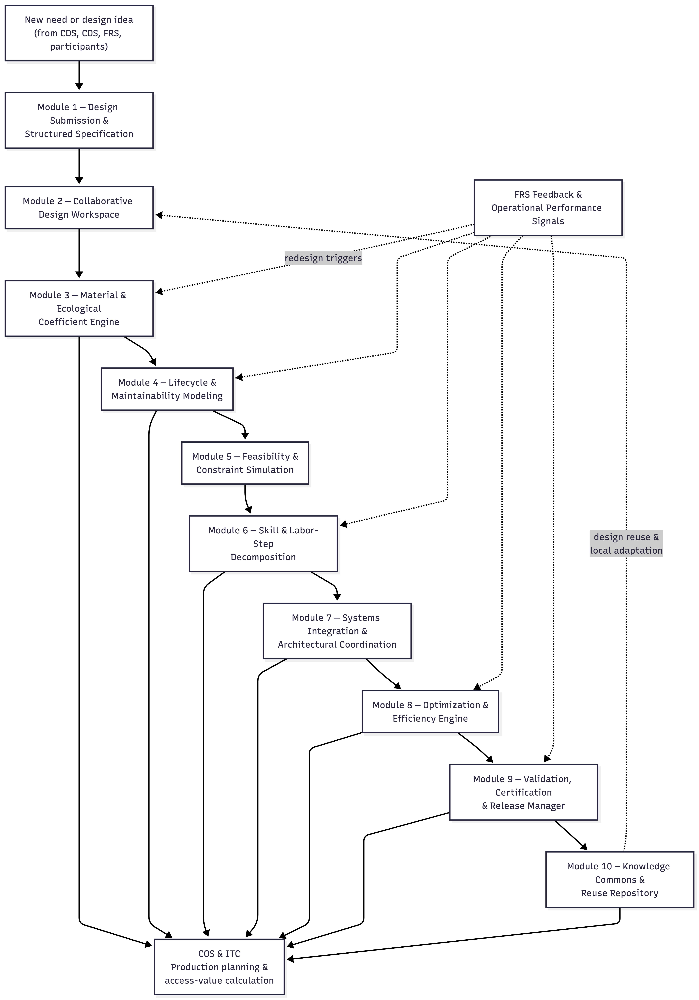

## 7.2 OAD Modules

If the CDS is Integral’s governance intelligence, the Open Access Design System (OAD) is its **collective engineering, architectural, and creative intelligence**—the subsystem through which the network conceives, models, optimizes, validates, and archives every design used across the federation.

In market economies, design is fragmented by secrecy, patents, and proprietary ecosystems. OAD replaces this with a **global design commons**, where:

- all designs are open,
- all improvements benefit everyone,
- ecological and material implications are visible upfront,
- lifecycle labor and maintenance requirements are quantified,
- and every node—no matter how small—contributes to and draws from the shared collective expertise.

OAD is not simply “open source engineering.”
It is a **cybernetic design organism** whose purpose is to generate the information that COS and ITC depend on for production coordination and value calculation. Without OAD’s structured design metadata—labor-step breakdowns, skill requirements, **material & ecological coefficients**, maintainability indices—COS cannot compute ITC access values or plan production intelligently.

Thus OAD:

- transforms ideas into structured design specifications,
- embeds ecological and lifecycle intelligence directly into designs,
- simulates performance and constraint compliance,
- optimizes for efficiency, modularity, repairability, and sustainability,
- ensures interoperability with **existing node infrastructure and federated Integral standards**,
- and continuously expands Integral’s global knowledge archive.

Every tool, machine, device, infrastructure, and workflow is part of a **recursively improving design ecology**.

**Design reuse is not a separate pathway—it is a recursion.**
Certified designs stored in the global commons (Module 10) are continuously pulled back into the **Collaborative Design Workspace (Module 2)** for local adaptation, contextual modification, and evolutionary branching.

Below is the complete **micro-architecture of OAD**, updated to reflect its central role in feeding COS and ITC with computable design intelligence.

------

**OAD Module Overview Table**

| **OAD Module**                                          | **Primary Function**                                         | **Real-World Analogs / Technical Basis**                     |
| ------------------------------------------------------- | ------------------------------------------------------------ | ------------------------------------------------------------ |
| **1. Design Submission & Structured Specification**     | Intake of new designs with metadata: purpose, constraints, labor-step outline, skill requirements, and expected lifecycle | OSHW templates, FreeCAD, Wikifactory                         |
| **2. Collaborative Design Workspace**                   | Multi-user refinement, transparent versioning, branch/merge workflows, community commentary | Git, Figma, CAD cloud platforms                              |
| **3. Material & Ecological Coefficient Engine**         | Compute ecological intensity, embodied energy, recyclability, toxicity, and material substitution pathways | OpenLCA, ecoinvent, embodied-carbon databases                |
| **4. Lifecycle & Maintainability Modeling**             | Determine expected maintenance intervals, replacement cycles, repair labor, modularity index | Asset lifecycle modeling, P-F curves, maintainability engineering |
| **5. Feasibility & Constraint Simulation**              | Physics-based modeling, structural tests, energy modeling, safety validation, environmental boundary checks | SimScale, OpenFOAM, EnergyPlus, dynamic digital-twin simulation |
| **6. Skill & Labor Step Decomposition Module**          | Convert design into explicit production tasks: skill tiers, time estimates, sequence logic | Industrial engineering methods, process mapping, MTM/REFA-like systems |
| **7. Systems Integration & Architectural Coordination** | Ensure compatibility with existing node infrastructure, interfaces, standardized modules, and federated design patterns | BIM, systems engineering frameworks, interoperability standards |
| **8. Optimization & Efficiency Engine**                 | Algorithmic improvements: reduce material intensity, minimize labor, optimize performance, maximize modularity | Parametric solvers, evolutionary algorithms, multi-objective optimization |
| **9. Validation, Certification & Release Manager**      | Quality control, final approval, version stamping, compliance with ecological and operational norms | PLM systems, OSHW certifications, formal verification pipelines |
| **10. Knowledge Commons & Reuse Repository**            | Global archive of all designs, metadata, versions, simulations, maintenance logs, and cross-node adoption | Wikimedia, open hardware libraries, federated knowledge bases |

------

### Module 1: Design Submission & Structured Specification

**Purpose**
To intake new design concepts in a structured, complete, and computable format suitable for engineering, ecological evaluation, and eventual COS–ITC processing.

**Description**
This module transforms a raw idea into a formally specified design object. It captures:

- functional purpose and design intent
- detailed component breakdown
- preliminary CAD geometry
- expected materials and their ecological coefficients
- performance criteria and environmental assumptions
- safety considerations
- early maintainability expectations
- preliminary labor-step outline (even if rough)

The structured template ensures that *every design enters OAD with enough metadata to begin evaluation and iteration immediately*.
This is the “front door” of the design organism.

**Example**
A contributor submits a modular water filtration unit. They upload preliminary CAD files, list bamboo and stainless options, define target flow rate, outline cleaning intervals, and include a rough labor-step sketch: frame fabrication → filter packing → flow testing. The module verifies the submission for completeness and moves it forward.

------

### Module 2: Collaborative Design Workspace

**Purpose**
To enable transparent, democratic, multi-user design refinement with full version control.

**Description**
This workspace supports:

- real-time co-editing of geometric and schematic models
- annotation and inline commenting
- branch-and-merge design variants
- parametric experimentation
- AI-assisted corrections and alternatives
- transparent version histories

This is the *collective design intelligence* of Integral—open, traceable, and free from proprietary locks.

**Crucially, this module is also the point of design reuse and local adaptation.**
Certified designs retrieved from the **Knowledge Commons (Module 10)** re-enter OAD here, where nodes can adapt them to local materials, climates, labor conditions, and cultural preferences while preserving full traceability to prior versions.

**Example**
Three variants of the filter housing emerge: recycled plastic, bamboo composite, and lightweight metal. Contributors run parallel branches, compare pros and cons, merge promising optimizations, and document every design path. Months later, a different node pulls the bamboo variant from the commons and adapts it for colder climates by thickening wall sections and altering seals—creating a new certified branch.

------

### Module 3: Material & Ecological Coefficient Engine

**Purpose**
To quantify the ecological footprint, sustainability, and material resource implications of every design choice.

**Description**
This module computes **material & ecological coefficients**, including:

- embodied energy
- carbon intensity
- recyclability / biodegradability
- toxicity profile
- regional material availability
- extraction and water-use implications
- suitability to local ecosystems

These coefficients form the **ecological intelligence layer** of OAD. They are required by **COS** to plan sustainable production and by **ITC** to calculate fair access values that reflect real material and ecological costs.

**Importantly, these coefficients are not static.**
Operational feedback from **FRS** can recalibrate them over time when real-world degradation, scarcity, or ecological strain diverges from initial design assumptions.

**Example**
The stainless-steel version flags high embodied energy. OAD recommends shifting to bamboo composite for low-impact regions or recycled plastic for nodes with industrial recycling capacity. Later, FRS reports faster-than-expected bamboo degradation in high-humidity coastal nodes, triggering a coefficient update and a redesign branch using treated composite layers.

------

### Module 4: Lifecycle & Maintainability Modeling

**Purpose**
To define the long-term labor burden, repair cycles, durability, and replacement intervals of a design.

**Description**
This module predicts:

- expected wear patterns
- mean time between failures (MTBF)
- required inspection intervals
- module replaceability
- disassembly and repair difficulty
- lubrication, cleaning, or recalibration steps
- cradle-to-cradle reuse pathways

The goal is to make **future maintenance labor explicit and computable**, rather than hidden or deferred. Outputs feed **COS** to plan maintenance cooperatives and **ITC** to compute **long-term labor burdens** that influence access values.

These models are continuously updated. Operational performance data from **FRS** recalibrates durability assumptions, maintenance intervals, and failure probabilities when real-world conditions diverge from modeled expectations.

**Example**
The initial filter design requires frequent disassembly. OAD models show that redesigning the housing to be tool-free reduces lifetime labor by 40%. After deployment, FRS confirms the reduced maintenance frequency in practice, reinforcing the new design as the preferred certified branch.

------

### Module 5: Feasibility & Constraint Simulation

**Purpose**
To test technical, safety, and operational feasibility using digital simulation and scenario analysis.

**Description**
Simulations include:

- structural stress, load, and fatigue
- fluid or airflow dynamics
- temperature, humidity, or chemical exposure
- manufacturability limits
- catastrophic failure modes
- maintenance feasibility
- environmental boundary conditions

Designs must pass feasibility thresholds before proceeding to labor decomposition and certification. This module ensures that **no design enters production with untested assumptions**.

Feasibility limits are not static; they can be **tightened or revised** as ecological thresholds or operational constraints evolve via CDS or FRS.

**Example**
CFD reveals back-pressure buildup in the filtration channel. A revised geometry improves throughput and safety margins, resolving the constraint automatically. Later, higher sediment loads reported by FRS trigger a re-run of simulations with updated boundary conditions.

------

### Module 6: Skill & Labor-Step Decomposition Module

**Purpose**
To convert a design into a computable labor plan usable by COS and ITC.

**Description**
This module creates:

- a full task decomposition (e.g., 14 steps)
- estimated hours per task
- skill tier requirements
- sequencing logic and dependency graph
- required tools and equipment
- ergonomic and safety notes
- maintainability labor profile (linked to Module 4)

This decomposition is the **bridge between design intelligence and economic coordination**. It allows:

- **COS** to schedule work, form cooperatives, and resolve bottlenecks
- **ITC** to compute fair access values based on real labor effort

**Labor-step models are revised when reality deviates from estimates.**
COS throughput data and FRS maintenance logs can trigger updates to time estimates, skill requirements, or task sequencing.

Without this module, Integral could not perform *non-market economic calculation*.

**Example**
The filtration unit decomposes into: frame cutting (low skill), housing assembly (medium), flow testing (medium/high), and seal inspection (medium). COS uses this to match workers, while ITC uses it to compute fair access values. After deployment, COS reports that seal inspection takes longer in sandy environments, prompting a labor-step update.

------

### Module 7: Systems Integration & Architectural Coordination

**Purpose**
To ensure that designs are compatible with existing infrastructure, standards, and federated patterns.

**Description**
This module evaluates how a design fits into the **broader technical, spatial, and systemic context** of a node and the federation. It checks:

- interface compatibility
- resource flows (water, power, waste, heat)
- spatial and architectural constraints
- safety clearances and access pathways
- interoperability with other OAD-certified modules
- emergent circularity opportunities across systems

This module prevents locally optimal designs from becoming **systemically incompatible**, brittle, or siloed.

It also ensures that designs align with **federated Integral standards**, enabling designs developed in one node to be adopted elsewhere without friction.

**Example**
OAD confirms the filtration unit fits neatly into existing rainwater capture systems and can integrate with a compost-heat loop, reducing mold risk and increasing performance. The module also flags that a standardized inlet size allows the unit to connect to other OAD-certified storage tanks.

------

### Module 8: Optimization & Efficiency Engine

**Purpose**
To improve a design through computational and participatory optimization across multiple dimensions.

**Description**
This module explores design improvements using algorithmic and collaborative methods. Optimization targets may include:

- material reduction
- structural strength and resilience
- energy efficiency
- reduced ecological footprint
- easier manufacturability
- simplified maintenance
- modularity, repairability, and recyclability

The engine may use evolutionary solvers, gradient descent, constraint optimization, and AI-assisted suggestions. Human contributors can guide optimization goals when trade-offs involve values or context-sensitive priorities.

Optimization outputs directly influence **COS production efficiency** and **ITC access-value calculations** by reducing labor, material, or maintenance burdens.

**Example**
Optimization reduces material usage by 27%, increases durability, and decreases required assembly time—lowering lifetime labor inputs and reducing ITC access requirements for the final product.

------

### Module 9: Validation, Certification & Release Manager

**Purpose**
To finalize a design as **production-ready**, ensuring it meets all ecological, operational, and governance requirements.

**Description**
This module performs final validation and certification checks, including:

- ecological compliance (based on Material & Ecological Coefficients)
- safety performance and failure tolerance
- manufacturability under COS conditions
- interoperability approval (Module 7)
- lifecycle and maintainability sign-off (Module 4)
- completeness and consistency of labor-step decomposition (Module 6)

Only designs that pass certification are released as **canonical OAD versions**. Each certified release includes full traceability: design history, simulation results, lifecycle assumptions, and governance metadata.

Certification status can be **revoked or updated** if later FRS data indicates divergence between modeled and real-world performance.

**Example**
The filtration design is certified after tests confirm safety, maintainability, and ecological requirements. COS is notified that production can begin. Months later, FRS feedback prompts a minor revision and re-certification for high-sediment environments.

------

### Module 10: Knowledge Commons & Reuse Repository

**Purpose**
To store and propagate the entire OAD design memory across the federation.

**Description**
This repository serves as Integral’s **global design commons**, ensuring that:

- all designs remain open and remixable
- designs are globally searchable and comparable
- metadata, simulations, and lifecycle records are preserved
- adaptations across climates and resource conditions are documented
- successful patterns propagate rapidly
- failed designs and lessons learned are retained

Designs stored here are not static artifacts. They are continuously pulled back into **Module 2 (Collaborative Design Workspace)** for local adaptation, contextual modification, and evolutionary branching.

This module constitutes Integral’s **evolving design genome**.

**Example**
A cold-climate adaptation appears: a freeze-resistant filter casing. Months later, a desert node merges its own sand-resistant prefilter, creating a hybrid version adopted globally.

------

Above Diagram: *Open Access Design System (OAD): Micro-Architecture and Feedback Loops*

This diagram illustrates the micro-architecture of the Open Access Design System (OAD) and its role as Integral’s collective design intelligence. The vertical flow represents the lifecycle of a design, beginning with a new need or idea and proceeding through structured specification, collaborative refinement, ecological and lifecycle modeling, feasibility simulation, labor decomposition, system integration, optimization, certification, and archival in the global design commons.

At multiple stages, OAD produces computable design intelligence—material and ecological coefficients, lifecycle and maintenance profiles, labor-step decompositions, interoperability constraints, and optimization results—which are consumed directly by the Cooperative Organization System (COS) and Integral Time Credits (ITC) for production planning and access-value calculation.

The diagram also highlights OAD’s recursive feedback structure. Operational performance data from the Feedback & Review System (FRS) feeds back into ecological coefficients, lifecycle assumptions, labor estimates, optimization targets, and certification status, ensuring that designs evolve in response to real-world conditions rather than remaining fixed abstractions.

Finally, the Knowledge Commons & Reuse Repository functions as a living design genome: certified designs are preserved globally and continuously re-enter the collaborative workspace for local adaptation, branching, and improvement. Together, these flows show OAD not as a static repository of blueprints, but as a self-correcting, federated design organism that enables non-market production coordination across the Integral network.**

------

### Narrative Snapshot: A Full OAD Walkthrough

A coastal Integral node is experiencing worsening **seasonal saltwater intrusion** into its freshwater wells. Rather than purchasing a proprietary desalination unit or relying on external supply chains, the community initiates an **open-access design pathway** to create a low-energy, modular desalination system appropriate for its climate and material conditions.

The moment the idea emerges, it enters **OAD**.

------

**Module 1 — Design Submission & Structured Specification**

A community member submits a concept for a **solar-assisted modular desalination unit**.
The structured template requires:

- functional goals (daily output, energy budget)
- preliminary CAD geometry
- materials assumptions
- ecological considerations
- maintenance expectations
- contextual conditions (humidity, solar exposure, brine disposal constraints)

OAD checks for completeness, classifies the submission, and confirms it is technically coherent enough to move into collaborative development.

------

**Module 2 — Collaborative Design Workspace**

Designers, engineers, and practitioners join a shared, version-controlled workspace.

Multiple branches emerge:

1. **Low-tech solar still** (simple, durable, low throughput)
2. **Fiber-membrane filtration unit** (moderate throughput, moderate complexity)
3. **Wave-energy-assisted design** (high potential efficiency, coastal specialization)

Branches evolve openly through:

- real-time annotations
- parametric adjustments
- AI-assisted geometry suggestions
- transparent version history

Ideas are not privatized; they are *co-evolving organisms* in a shared ecosystem.

------

**Module 3 — Material & Ecological Coefficient Engine**

Each branch is evaluated for:

- embodied energy
- material toxicity
- recyclability
- water and land footprint
- compatibility with local ecosystems
- repairability
- brine disposal safety

The membrane-based design raises concerns:

- high embodied energy
- petroleum-derived plastic components
- difficult end-of-life recycling

The engine suggests lower-impact alternatives: **biodegradable fiber supports, bamboo structuring**, and reduced resin use.

A **more ecologically viable branch** is spawned.

------

**Module 4 — Lifecycle & Maintainability Modeling**

To prevent fragile or short-lived designs, OAD simulates:

- expected lifespan
- maintenance intervals
- failure modes
- labor intensity of upkeep
- required skills for repairs
- impacts under extreme climate conditions

The high-throughput membrane design shows excessive long-term maintenance demand.
Conversely, the hybrid solar/fiber design:

- requires low-skill maintenance
- has long component lifespan
- is resilient under salt-corrosion scenarios

This dramatically affects later **ITC access valuation** once operational—lower maintainability burden → lower access cost.

------

**Module 5 — Feasibility & Constraint Simulation**

Now the system tests whether the design **physically works**:

- thermal gradients
- condensation efficiency
- fluid dynamics
- shell stress loads
- material response to continuous salt exposure
- extreme-weather tolerance

A thermal-flow simulation reveals the internal condensation baffle is angled incorrectly.
A revised geometry increases output by **21%** with *no additional materials*.

At this stage the design is no longer speculative—it is **functionally sound**.

------

**Module 6 — Skill & Labor-Step Decomposition**

OAD now breaks the design into **explicit labor steps**, producing the data COS and ITC need for accurate non-market economic calculation.

For the desalination unit:

- fabrication steps (cutting, fitting, sealing)
- assembly sequences
- expected labor hours by skill level
- tooling and workspace requirements
- maintenance steps and periodic workloads

This module outputs:

1. **Labor coefficients** → fed directly into ITC valuation
2. **Skill-matching requirements** → fed to COS for cooperative formation
3. **Maintainability workload expectations** → fed to FRS for long-term monitoring

This is where OAD begins interfacing directly with the **future access cost of the good**.

------

**Module 7 — Systems Integration & Architectural Coordination**

The system checks whether the desalination unit harmonizes with:

- local rainwater collection
- solar-electric infrastructure
- greywater loops
- COS-controlled fabrication capacity
- locally available materials
- spatial constraints
- brine disposal pathways

A synergy emerges: **routing waste heat from the unit into a nearby greenhouse increases winter crop yield**.

The design becomes *part of a system*, not an isolated object.

------

**Module 8 — Optimization & Efficiency Engine**

Now the design is improved through algorithmic and participatory refinement:

- reduce material volume
- improve thermal retention
- increase throughput
- simplify assembly
- increase durability
- reduce long-term maintenance
- minimize labor requirements where possible

A parametric optimization cycle yields:

- **26% reduction in material use**
- **19% improvement in condensation efficiency**
- simplified geometry enabling tool-less assembly
- improved robustness via modular gasket design

The design is now *approaching optimality*.

------

**Module 9 — Validation, Certification & Release Manager**

Before any design can enter production, it must:

- pass ecological thresholds
- pass safety and stress modeling
- pass maintainability checks
- confirm manufacturability within at least one node
- confirm systems-integration compliance
- produce a full documentation bundle

Once validated, the desalination unit gains:

- a canonical version
- full build package
- maintenance registry
- interoperability metadata
- access-value-relevant valuations (labor, materials, impacts)

The design becomes **production-ready**.

------

**Module 10 — Knowledge Commons & Reuse Repository**

The final design enters the global commons:

- the certified core version
- all explored branches
- ecological coefficients
- lifecycle models
- labor-step breakdowns
- simulation results
- optimization history
- climate-specific adaptations

**Design reuse now becomes recursive.**
Certified designs are continuously pulled back into **Module 2** by other nodes for local adaptation.

Weeks later, an inland node dealing with saline groundwater adapts the unit using **geothermal pre-heating**.
That variant is certified and re-enters the commons—contributing back into OAD’s collective learning process.

Meanwhile, **FRS operational data** from deployed units feeds back into:

- updated ecological coefficients (Module 3)
- revised maintenance assumptions (Module 4)
- corrected labor estimates (Module 6)
- optimization priorities (Module 8)
- and, if needed, re-certification (Module 9)

No patents. No market silos. No intellectual-property rent.

Just **collective intelligence → ecological evaluation → simulation → optimization → certification → global inheritance → real-world feedback**.

A civilization designing like an expanding, learning organism. Not for profit — **for life, resilience, and shared flourishing**.

------
